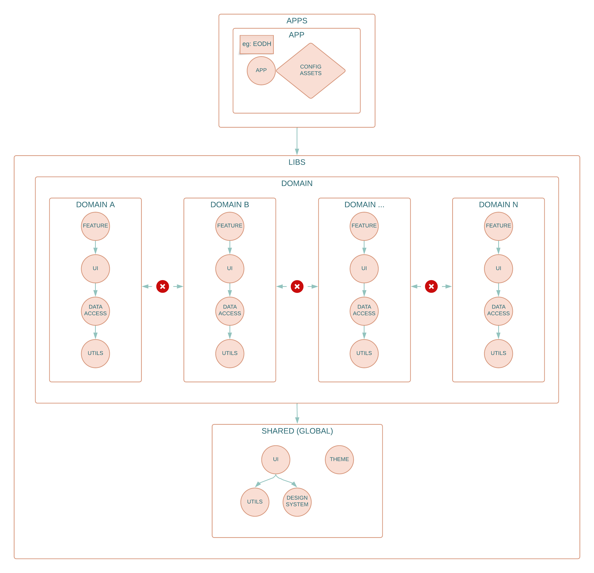

# General rules

Monorepo approach is used. Main code lives in `libs` directory as a `project`.
Currently, there is one `application`, but multiple `applications` are supported.

Rules:

- all `applications` should be placed in `apps` directory,
- most of the code should be placed in `libs` directory,
- `app` should be a tinny wrapper and should use code from `libs` directory,
- `libraries` can use another `libraries`,
- `applications` can not use another `applications`,

### Enforce module boundaries

Eslint plugin `@nrwl/nx/enforce-module-boundaries` is used to enforce module boundaries.
Check `.eslintrc.json` file for detailed configuration,

# Architecture

Project follows DDD (Domain Driven Design) pattern and extends [NX approach](https://nx.dev/more-concepts/library-types) to enforce module boundaries.
In `NX` there are four types of libraries:

- `utils`
- `data-access`
- `ui`
- `feature`

## Diagram

## Types of libraries

### Utils

#### What is it?

A utility library contains low level code used by many libraries. Often there is no framework-specific code and the library is simply a collection of utilities or pure functions.

#### Naming Convention

util (if nested), or `util-*` (e.g., `util-testing`)

### Data-access

#### What is it?

Data-access libraries contain code that function as client-side delegate layers to server tier APIs.

All files related to state management also reside in a data-access folder (by convention, they can be grouped under a +state folder under src/lib).

#### Naming Convention

data-access (if nested) or `data-access-*` (e.g. `data-access-seatmap`)

#### Dependency Constraints

A data-access library can depend `util` libraries.

### UI

#### What is it?

A UI library is a collection of related presentational components.
UI is an independent component which can be a part of the page (it may have its own logic related to BE communication).

#### Naming Convention

ui (if nested) or `ui-*` (e.g., `ui-buttons`)

#### Dependency Constraints

A ui library can depend on `util` or `data-access` libraries.

### Feature

#### What is it?

A feature library contains a set of files that configure a business use case or a page in an application.
Feature is a whole page, where UI is a small subset of such page. Feature may contain multiple pages.

#### Naming Convention

feature (if nested) or feature-\* (e.g., feature-home).

#### Dependency Constraints

A feature library can depend on `ui`, `data-access` or `utils` libraries.

## Multiple dimensions

There are multiple dimensions used to enforce `project` dependencies.

> Depends on the project, 1 (app) 3 (lib) or 4 (lib/shared) dimensions should be used to properly enforce module boundaries

### First dimension - app & library

Distinction between library and application

- `type:lib` - project tagged with `type:lib` can use another projects tagged only with `type:lib`
- `type:app` - project tagged with `type:app` can use another projects tagged only with `type:lib`

### Second dimension - library type

- `lib:shared:theme`,
- `lib:shared:utils`,
- `lib:shared:ui`,
- `lib:domain:utils`,
- `lib:domain:utils:shared`,
- `lib:domain:data-access`,
- `lib:domain:ui`,
- `lib:domain:ui:shared`,
- `lib:domain:feature`,

### Third dimension - domain vs domain shared

Distinction between `shared` (across all domains) and `domain` specific code

- `domain:shared` - tag which allows to share across all domains
- `domain:*`, where `*` should be changed to specific domain name

Currently, there are 4 domains:

- `account`
- `asset`
- `alert`
- `system-map`

### Fourth dimension - global shared additional rules

This is only applied to libraries placed in `libs/shared`.
Additional, 4th dimension is used to enforce proper structure for libraries in this directory.

- `shared:theme` - projects tagged with `shared:theme` can only use other projects tagged with this tag,
- `shared:utils/common` - projects tagged with `shared:utils/common` can not use other projects,
- `shared:utils` - projects tagged with `shared:utils` can only use other projects tagged with: `shared:utils/common`,
- `shared:ui/common` - projects tagged with `shared:ui/common` can use other projects tagged with: `lib:shared:theme`,
- `shared:ui` - projects tagged with `shared:ui` can only use other projects tagged with tags: `shared:theme`, `shared:utils/common`, `shared:utils`, `shared:ui/common`,

# Project vocabulary

- `project`- project is a `NX` term. `Project` may be either an `application` or `library`.
- `tag` - Tags are generic mechanism for expressing constraints on project dependencies. Check [docs/nx.md#tags](./docs/tags.md#tags) file for more detailed information about tags.
